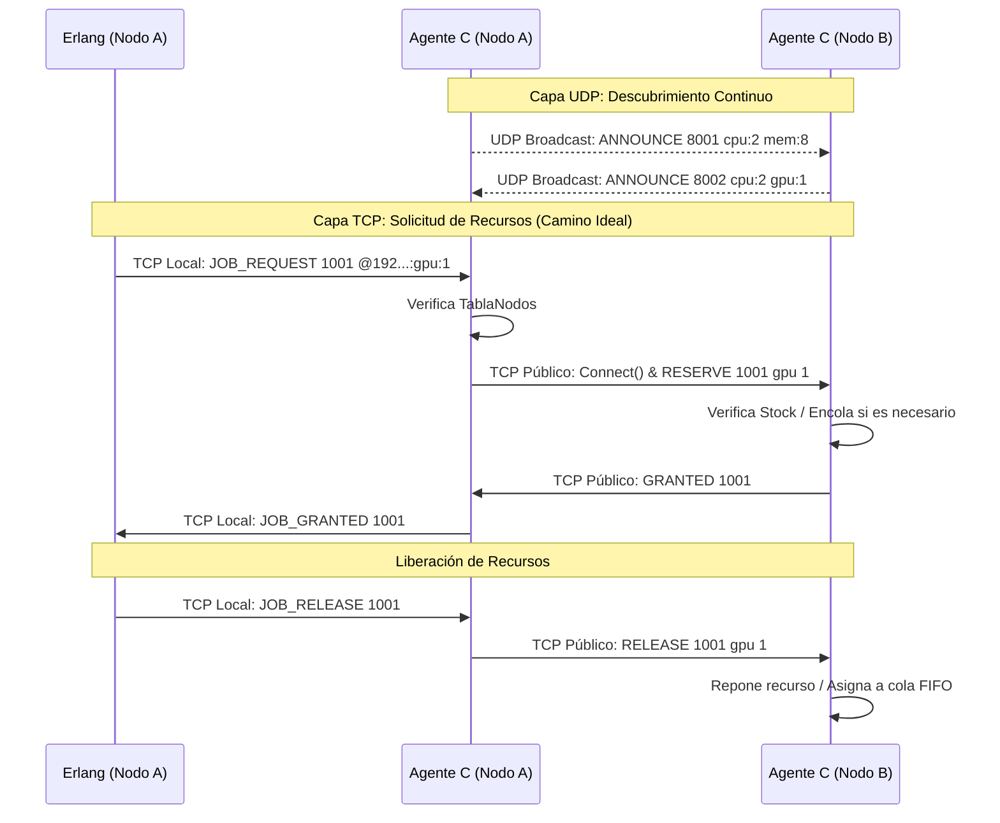
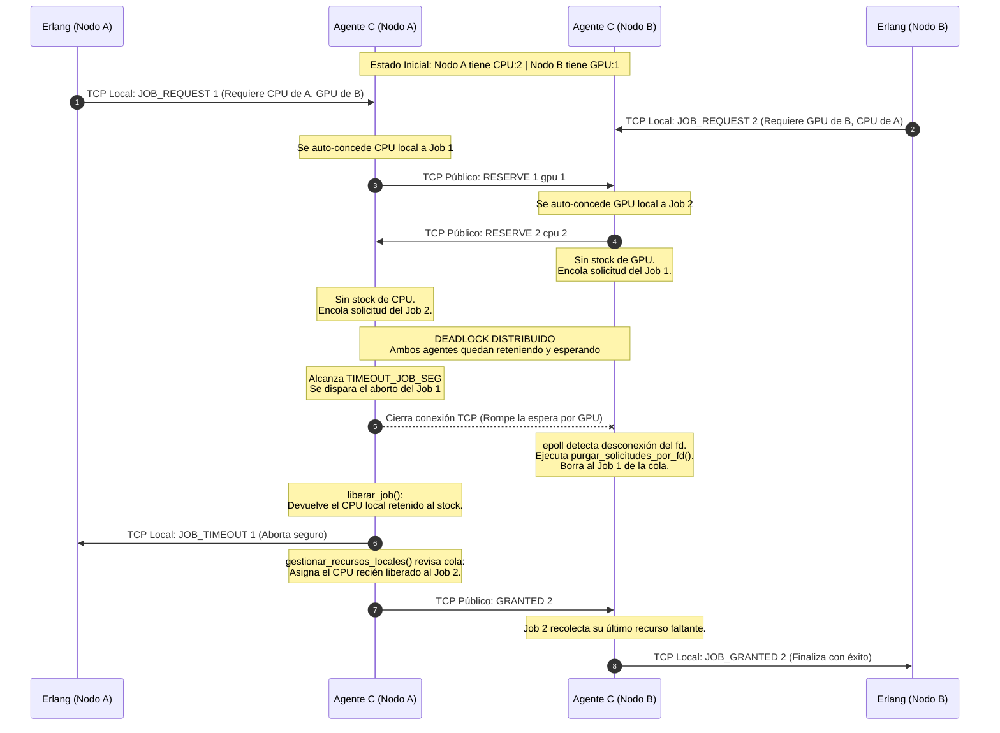

# Informe - Agente Distribuido para Gestión de Recursos HPC

## Resumen

El presente trabajo consiste en el desarrollo de un middleware distribuido para la administración de recursos (CPU, memoria y GPU) en un clúster de nodos. El sistema permite descubrir automáticamente nuevos nodos mediante UDP Broadcast y coordinar reservas de recursos utilizando conexiones TCP no bloqueantes administradas con epoll. Asimismo, incorpora una interfaz local exclusiva para atender las solicitudes de un planificador Erlang.

### Diseño del sistema

El middleware fue diseñado utilizando una arquitectura distribuida asincrónica de tres capas.
Para cumplir con los requisitos de alto rendimiento y evitar el bloqueo de los agentes, se optó por un modelo orientado a eventos utilizando `epoll` en C.

* **Descubrimiento Dinámico:** Se implementó mediante sockets UDP interactuando con la red en modo Broadcast (`255.255.255.255`). Un temporizador (`timerfd`) no bloqueante dispara envíos periódicos (`ANNOUNCE`) cada 3 segundos, permitiendo mantener una tabla de enrutamiento local actualizada con un tiempo de caducidad de 15 segundos.

* **Comunicación entre Agentes:** Se resolvió utilizando sockets TCP públicos configurados estrictamente con `O_NONBLOCK`. La gestión de concurrencia a través de `epoll` permite escalar el servidor para manejar múltiples peticiones simultáneas (`RESERVE`, `GRANTED`, `DENIED`, `RELEASE`) sin detener el hilo principal de ejecución.

* **Interfaz Local:** Se expuso un servidor TCP atado a la interfaz loopback (`127.0.0.1`) que actúa como puerta de enlace exclusiva para el planificador Erlang.

Para garantizar la integridad transaccional, el agente mantiene un estado interno riguroso (`TablaJobActivos`) que contabiliza los recursos esperados, los concedidos y los denegados, facilitando operaciones atómicas distribuidas.

### Diagrama de Secuencia de Comunicación

### Problemas encontrados y soluciones

Durante el desarrollo y las pruebas de verificación, nos enfrentamos a desafíos propios de los sistemas distribuidos:

* **Problema 1:** El falso "Deadlock" por IPs compartidas en pruebas locales.

    - *Descripción:* Al testear múltiples nodos en la misma máquina física, la función de búsqueda de nodos se conectaba al propio nodo local en un bucle infinito al compartir la IP LAN, abortando la transacción al no encontrar el recurso esperado.

    - *Solución:* Se optimizó la función de enrutamiento (`buscar_puerto_por_IP_y_recurso`) introduciendo una capa de validación extra mediante `strstr`. El nodo ahora verifica no solo la IP, sino que el puerto destino efectivamente haya anunciado poseer el recurso solicitado.

* **Problema 2:** Limpieza prematura y pérdida de la Cola FIFO.

    - *Descripción:* Tras recibir un `GRANTED`, el socket TCP se cerraba inmediatamente. Esto disparaba la rutina de tolerancia a fallos del nodo remoto, el cual detectaba la "caída" del cliente y devolvía el recurso prestado al stock, arruinando el encolamiento de futuras peticiones.

    - *Solución:* Se rediseñó el ciclo de vida de la conexión. Los File Descriptors remotos ahora se guardan en la estructura de estado del Job. La conexión TCP se mantiene viva de forma intencional hasta que Erlang solicita el `JOB_RELEASE`, momento en el cual se envía la orden de liberación y se cierra ordenadamente el socket, permitiendo a las colas FIFO operar correctamente.

* **Problema 3:** Ejecución de la guillotina de Time-Out en jobs encolados.

    - *Descripción:* El Time-out inicial de 10 segundos abortaba transacciones válidas que simplemente estaban esperando en la cola FIFO del nodo remoto, ya que el protocolo no cuenta con un mensaje de "estado en espera".

    - *Solución:* Se amplió el Time-out general a 120 segundos. Esto cubre el ciclo de vida real de los jobs, delegando la recuperación ante fallos de hardware a los cierres instantáneos de TCP y a la caducidad del Broadcast UDP, dejando el Time-Out únicamente como salvaguarda extrema para interbloqueos lógicos.

* **Problema 4:** Pedidos imposibles

    - *Descripción:* Inicialmente, una solicitud como `RESERVE cpu 100`en un nodo cuya capacidad máxima era `cpu:2` era agregada a la cola FIFO.
    Como esa cantidad nunca podría existir, la solicitud permanecía esperando hasta que expiraba el timeout del Job.

    - *Solución:* Se implementó una validación preventiva (`cantidad solicitada > capacidad total`), que al cumplirse el nodo responde `DENIED` inmediatamente evitando ocupar espacio y recursos de procesamiento en la cola.

* **Problema 5:** Llegada tardía de respuestas (Race Condition)

    - *Descripción:* Un Job podía expirar por timeout y ser eliminado de la tabla local mientras un nodo remoto todavía estaba procesando la reserva. Si posteriormente llegaba `GRANTED` para ese JOb inexistente, el recurso quedaba reservado indefinidamente en el nodo remoto *(Fuga de recursos distribuidos)*.

    - *Solución:* Se implementó una lógica de compensación.Cuando llega un `GRANTED` para un Job inexistente, el agente inicia automáticamente una conexión de compensación y envía `RELEASE` al nodo remoto. Recuperando inmediatamente los recursos concedidos fuera de tiempo.
  
* **Problema 6:** Recuperación tras desconexiones inesperadas

    - *Descripción:* Un cliente TCP podía desconectarse bruscamente (falla de red o caída) sin enviar `RELEASE`, provocando que el nodo retuviera permanentemente los recursos asignados.

    - *Solución:* Cada recurso mantiene una tabla de asignaciones asociada al descriptor de socket del cliente. Cuando `epoll` detecta la desconexión o ruptura del socket, el sistema recorre todas las asignaciones, recupera automáticamente los recursos al stock disponible y elimina las solicitudes pendientes pertenecientes a dicho cliente.
  
### Estrategia contra el Deadlock
Nuestra implementación resuelve automáticamente el interbloqueo mediante timeout y rollback distribuido.

Para evitar la formación de interbloqueos distribuidos, nuestra arquitectura ataca directamente la condición de **Retención y Espera** (Hold and Wait) implementando una estrategia de Prevención mediante **Rollback Automático**.

*Justificación:* En un entorno sin un coordinador central de bloqueos, si un Job requiere recursos de múltiples nodos, podría obtener una parte de los recursos y permanecer esperando indefinidamente por el resto, mientras otros Jobs hacen lo mismo, generando una espera circular. Nuestra estrategia obliga a que la reserva sea "todo o nada". Si un solo componente falla o es denegado, el sistema retrocede (rollback) y libera inmediatamente lo retenido parcial, rompiendo cualquier posible espera circular.
**Un Job únicamente se considera exitoso cuando todos los recursos solicitados fueron concedidos.**

#### Ejemplo Paso a Paso (Demostración con 2 Nodos)

1. Erlang (en Nodo A) solicita lanzar el `Job 2000`, el cual requiere `cpu:1` y `gpu:99` (cantidad imposible) alojados en el Nodo B.
2. Nodo A abre conexiones TCP y envía simultáneamente los pedidos al Nodo B.
3. Nodo B tiene stock de CPU y responde `GRANTED 2000` *(Concede el CPU)*.
4. Nodo B verifica que `gpu:99` excede su capacidad física y responde `DENIED 2000`.
5. Nodo A intercepta ambas respuestas. En su tabla transaccional verifica que `cantidad_denegados > 0`. El sistema detecta que la transacción global fracasó.
6. **Rollback:** El Nodo A automáticamente interviene sin que Erlang se lo pida, y envía un `RELEASE 2000 cpu 1` al Nodo B para devolver el `CPU` que le habían dado en el paso 3.
7. El Nodo A cierra la transacción informando a Erlang el mensaje `JOB_DENIED 2000`. Ningún recurso queda retenido.

#### Escenario de deadlock distribuido
(Para una demostración más rápida bajar TIMEOUT_JOB_SEG a 15)

**Escenario:**
Nodo A: 2 CPUs, 8 GB RAM, 0 GPU.
Nodo B: 2 CPUs, 4 GB RAM, 1 GPU.

Job1 (desde A): necesita 2 CPUs de A y 1 GPU de B.
Job2 (desde B): necesita 1 GPU de B y 2 CPUs de A.

**1. El Inicio:**
I. El Nodo A pide sus 2 CPUs y la GPU del Nodo B. Se auto-concede sus 2 CPUs y manda el TCP al Nodo B por la GPU.
II. El Nodo B pide su GPU y 2 CPUs del Nodo A. Se auto-concede su GPU y manda el TCP al Nodo A por los CPUs.

**2. El Bloqueo (Deadlock):**
I. El Nodo A recibe la petición de B, pero como ya le dio sus CPUs al Job 1, encola al Job 2 en su Cola FIFO.
II. El Nodo B recibe la petición de A, pero como ya le dio su GPU al Job 2, encola al Job 1 en su Cola FIFO.

Ambos quedarán esperando.

**3. La Resolución:**
Como ambos Jobs permanecen esperando, comienza a correr el temporizador asociado a la transacción. Cuando se alcanza `TIMEOUT_JOB_SEG`, uno de los nodos (supongamos el Nodo A) aborta automáticamente el Job.

El Nodo A considera fallida la transacción y ejecuta automáticamente el rollback en 2 etapas:

**Fase 1 (Limpieza de la Cola):** El Nodo A cierra el socket de la petición de GPU que quedó trabada. Al instante, el epoll del Nodo B detecta que A se desconectó y ejecuta `limpiar_recursos_por_desconexion()` y `purgar_solicitudes_por_fd()`, eliminando de su cola de espera cualquier solicitud perteneciente al Job 1

**Fase 2 (Liberación de recursos retenidos):** El Nodo A aborta el Job 1 y ejecuta `liberar_job()`.  Como el Job 1 había conseguido previamente la GPU del Nodo B, el Nodo A envía automáticamente: `RELEASE Job1 gpu 1` al Nodo B.
Al mismo tiempo, el Nodo A libera localmente las 2 CPUs que estaban reservadas para el Job 1 mediante la lógica de `gestionar_recursos_locales()`.

De esta manera, tanto la GPU del Nodo B como las CPUs del Nodo A vuelven a quedar disponibles.

**4. El Desbloqueo (Fin del Deadlock):**
Al liberarse las 2 CPUs del Nodo A, la función `gestionar_recursos_locales` revisa la cola FIFO y se detecta que en la primera posición se encuntra el Job 2 del Nodo B que estaba esperando exactamente esos recursos. Se los concede automáticamente y le manda `GRANTED job2` al Nodo B.

Por otro lado, cuando el Nodo B recibe `RELEASE Job1 gpu 1` también libera su GPU y elimina de su cola FIFO la solicitud correspondiente al Job 1, ya que el Nodo A había cerrado la conexión al producirse el timeout.

**5. Resultado final:**
El Job 2 del Nodo B obtiene todos sus recursos solicitados y finaliza con éxito (`JOB_GRANTED Job2`). El Job 1 del Nodo A aborta de forma segura , se liberan todos los recursos que hubiera obtenido parcialmente, y envia `JOB_TIMEOUT Job1` a Erlang, permitiendo que el planificador intente de nuevo más tarde.

**Diagrama del escenario:**

### Roles y contribuciones

**Antonella Grassi:** Desarrollo integral del Agente Intermediario en lenguaje C. Implementación de concurrencia y red asincrónica con la librería epoll. Diseño de las estructuras de datos transaccionales, programación de las colas FIFO de recursos y diseño algorítmico del mecanismo de Rollback para la prevención de Deadlocks. Implementación del sistema de recuperación ante fallos (timeouts, desconexiones y nodos caídos). Confección de la documentación técnica y pruebas de validación.

> Observación: El presente trabajo fue desarrollado íntegramente por Antonella Grassi, ya que la asignatura fue cursada previamente y, en esta instancia, únicamente debía rendirse la parte correspondiente al agente implementado en C.
